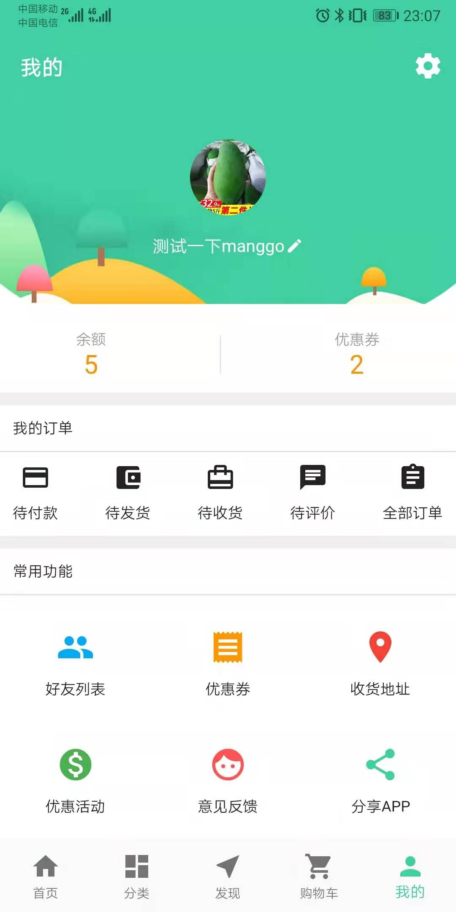

# 一个用于学习flutter的商城项目（所有数据来自真实接口）
项目持续更新中...

# 商城部分截图：

                                                                                  

                                                                                  
# 项目结构如下： 
├── /components/ #自定义组件目录 
│ ── ├── /loading.dart #一个自定义的loading加载组件 
│ ── ├── /NavList.dart #首页导航组件 
│ ── ├── /NavBottomItems.dart #界面底部导航组件 
│ ── └── /ProductList.dart #首页商品列表组件 
├── /config/ #配置文件目录 
│ ── ├── /web.config.js #接口地址配置 
├── /model/ #数据模型JSON目录（后缀为.g.dart文件自动生成的） 
│ ── ├── /cart.dart #购物车列表 
│ ── ├── /cart.g.dart #解析购物车列表json 
│ ── ├── /classify.dart #商品分类 
│ ── ├── /classify.g.dart #解析商品分类json 
│ ── ├── /comment.dart #通用数据模型 
│ ── ├── /comment.g.dart #解析通用数据json 
│ ── ├── /detail.dart #商品详情 
│ ── ├── /detail.g.dart #解析商品详情json 
│ ── ├── /order_detail.dart #订单详情 
│ ── ├── /order_detail.g.dart #解析订单详情json 
│ ── ├── /order_list.dart #订单列表 
│ ── ├── /order_list.g.dart #解析订单列表json 
│ ── ├── /user_address.dart #用户收货地址 
│ ── ├── /user_address.g.dart #解析用户收货地址json 
│ ── ├── /user_coupon.dart #用户优惠券 
│ ── ├── /user_coupon.g.dart #解析用户优惠券json 
│ ── ├── /user_ifo.dart #用户资料 
│ ── └── /user_ifo.g.dart #解析用户资料json 
├── /router/ #路由配置目录 
│ ── ├── /application.dart #初始化路由变量 
│ ── ├── /router_handler.dart #路由方法处理 
│ ── └── /routes.dart #定义路由 
├── /utils/ #utils工具目录 
├── /view/ #项目界面目录 
│ ── ├── /classify/ #分类模块 
│ ── │ ── ├── /index.dart #分类界面 
│ ── │ ── └── /list.dart #分类商品界面 
│ ── ├── /find/ #发现模块 
│ ── │ ── ├── /list.dart #发现列表界面 
│ ── │ ── └── /detail.dart #发现详情界面 
│ ── ├── /home/ #首页模块 
│ ── │ ── ├── /index.dart #首页界面 
│ ── │ ── └── /detail.dart #商品详情界面 
│ ── ├── /login/ #登录模块 
│ ── │ ── ├── /login.dart #登录界面 
│ ── │ ── ├── /register.dart #注册界面 
│ ── │ ── └── /setPassword.dart #设置密码界面 
│ ── ├── /user/ #用户模块 
│ ── │ ── ├── /addMap #添加收货地址界面 
│ ── │ ── ├── /cart #购物车界面 
│ ── │ ── ├── /confirmOrder #确认订单界面 
│ ── │ ── ├── /coupon #优惠券列表 
│ ── │ ── ├── /index #个人中心首页 
│ ── │ ── ├── /mapList #收货地址列表界面 
│ ── │ ── ├── /orderDetail #订单详情界面 
│ ── │ ── ├── /orderList #订单列表界面 
│ ── │ ── ├── /orderMap #收货地址列表界面 
│ ── │ ── └── /server #客服中心界面 
└── main.dart #项目入口文件 
